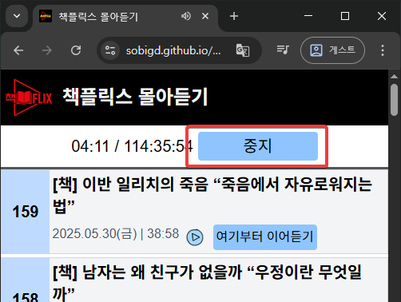
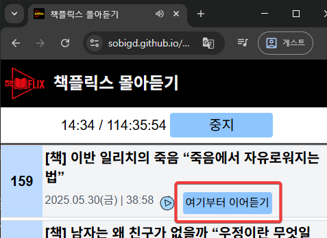
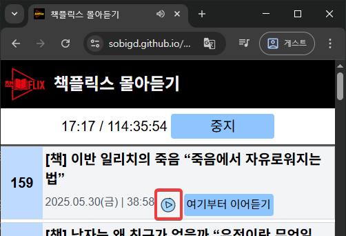
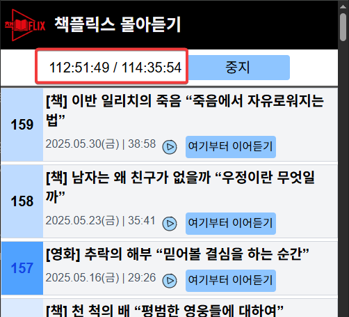
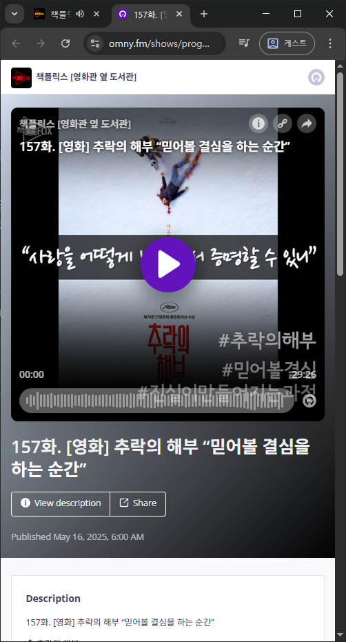
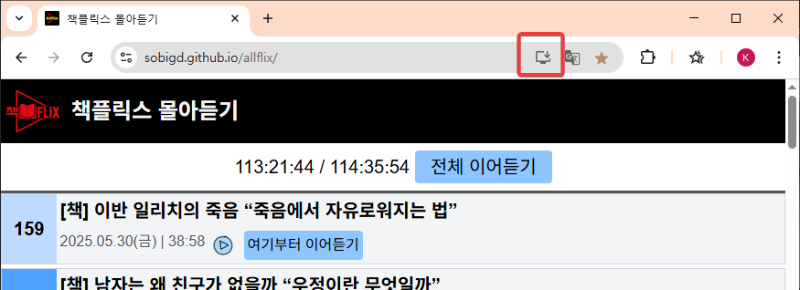
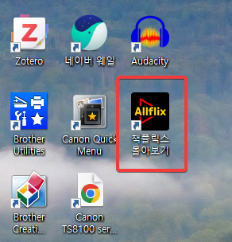
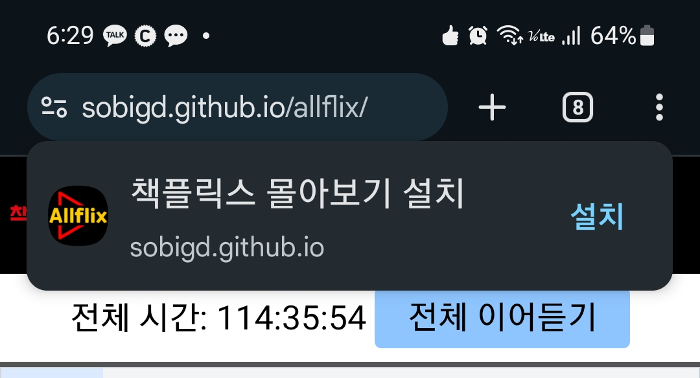
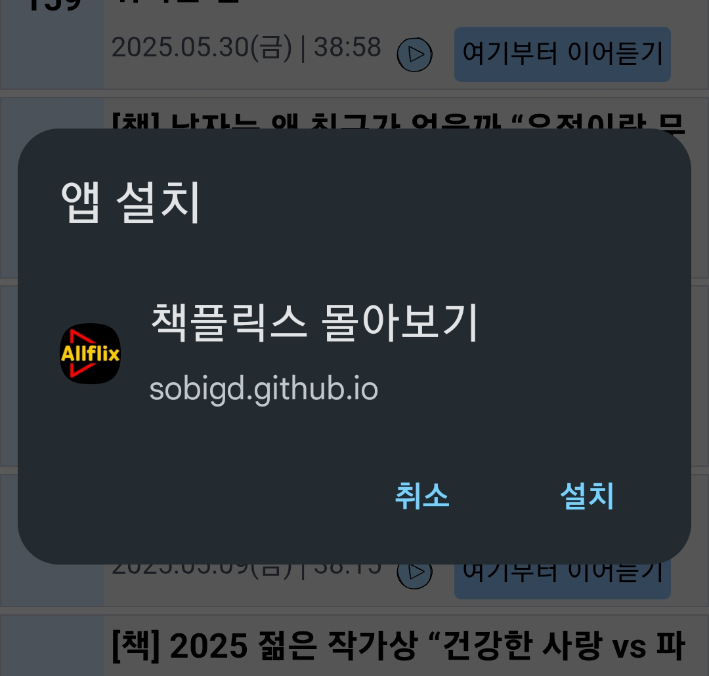

#  allflix

## 책플릭스 몰아듣기

### 접속 방법
웹브라우저에서 [https://sobigd.github.io/allflix](https://sobigd.github.io/allflix) 으로 접속

 

### 만든 이유

책플릭스를 **첫 화부터 정주행** 하려는데 굉장히 번거롭고 어디까지 들었는지 알기도 어렵고 해서 **책플릭스 정주행 전용 앱**을 만들어 봄.

스마트폰에서 사용할 목적으로 만듦.

 

### 로고

 왼쪽과 같은 책플릭스 로고 original을 패러디한 짝퉁.

 

### 기본 동작

맨 위 [전체 이어듣기] 버튼을 누르면 직전에 듣기를 멈춘 위치부터 재생이 시작된다.  
중간에 멈추려면 맨 위 [중지] 버튼을 누른다.

[전체 이어듣기] 버튼을 누르고 가만 놔두면 현재 에피소드 재생이 끝난 후 바로 위 에피소드가 재생된다. 그래서 그냥 놔두면 1화부터 가장 최신 에피소드까지 순서대로 쭉 재생된다. (작성일 현재 1화부터 최신 에피소드까지 전부 다 듣는데 약 115시간이 소요된다)

[전체 이어듣기] 재생 중 맨 위 [중지] 버튼을 누르면 현재 위치가 현재 사용 중인 디바이스에 저장된다. 이 값은 해당 디바이스에만 저장되기 때문에 스마트폰에서 듣다가 PC에서 그 위치부터 이어듣는 등의 기능은 제공하지 않는다.

 

### 사용법

#### 전체 이어듣기

[전체 이어듣기] 버튼을 누르면 직전에 멈춘 위치부터 재생이 시작된다. 맨 처음 실행한 거면 1화부터 시작된다.

1화 재생이 끝나면 자동으로 그 다음 화인 2화가 재생된다.

가만 놔두면 3화, 4화... 가장 최신 에피소드까지 자동으로 진행한다.

 

#### 잠깐 멈추기

[전체 이어듣기]를 눌러 재생이 시작되변 이 버튼이 [중지] 버튼으로 바뀐다

현재까지 정식 에피소드만 159화, 약 115시간이 올라왔기 때문에 계속 듣고만 있을 수는 없다. 재생을 잠깐 멈추려면 위와 같이 [중지] 버튼을 누른다.

[중지] 버튼을 누르면 중지 버튼을 누른 위치가 디바이스에 저장된다. 저장되는 정보는 현재 에피소드 고유번호(guid)와 그 에피소드의 현재까지 재생된 시간(초)이다. 

예를 들어 157화를 19초까지 들었다면 `157화 19초` 정보가 저장된다.

[중지] 버튼을 누르면 그 버튼이 다시 [전체 이어듣기]로 바뀐다. 

 

#### 다시 전체 이어듣기

`157화 19초` 정보가 저장되어 있는 상태에서 [전체 이어듣기] 버튼을 누르면 allfilx는 157화 19초부터 재생을 시작한다. 이런 식으로 끊김없이 책플릭스 전체 에피소드를 다 들을 수 있다.

 

#### 여기부터 이어듣기

특정 에피소드부터 듣고 싶을 때 사용한다. 역시 그 에피소드가 끝나면 자동으로 그 바로 위 에피소드가 재생된다.

 

#### 어느 한 에피소드만 듣기

이 버튼을 누르면 전체 이어듣는 것과 관련없이 그냥 한 번 듣고 끝난다. 전체 이어듣는 위치와 전혀 관련이 없다. 전체 이어듣기(정주행)하다 정주행에는 영향을 미치지 않고 어느 한 에피소드를 듣고 싶을 때 사용한다.

 

#### 전체 시간

전체 시간은 2개의 시간으로 구성되어 있다. / 으로 구분되어 있는데, / 뒷부분은 여태까지 나온 모든 에피소드의 각 재생시간을 모두 더한 값이다. 거의 115시간 분량이다.

/ 앞부분은 전체 재생시간 중 어느만큼 듣고 있는지 보여주는 부분이다. 만약 157화를 재생하고 있다면 156화 까지의 재생시간의 총합 + 현재 재생하고 있는 157화의 현재 재생위치(예를 들면 01:15)를 더한 값을 보여준다.

마지막 화까지(제작일 현재 159화) 다 들으면 현재 총 시간인 `114:35:54`를 넘는 값(예: `114:35:56`)이 나오는데 이건 매우 당연한 결과다. 

각 에피소드에는 재생시간이 초단위로 적혀있다. 만약 55.4초 길이의 에피소드라면 이 에피소드의 재생시간은 55초로 적혀 있다. 이렇게 0.4초 같은 오차가 159화만큼 모이면 굉장히 큰 값이 될 수 있다. 

총 재생시간(`114:35:54`)은 `55.4초`를 `55초`로 보고 쭉 더한 결과이기 때문에 오차가 발생할 수 밖에 없다. 

그래서 / 앞부분에서 보여지는 현재 재생시간이 / 뒷부분에 보여지는 총 재생시간보다 더 커질 수 있.. 밖에 없다.

 

#### 에피소드 정보보기

제목 부분을 클릭하면 에피소드 정보를 볼 수 있다.

pc에서는 새로 열린 탭을 닫으면 창이 닫히고 스마트폰에서는 왼쪽 위의 X 표를 누르면 창이 닫힌다.

 

#### 현재 위치 자동 저장

이 프로그램은 재생 시 약 10초 정도마다 한 번씩 현재 위치를 저장한다. 혹시라도 갑자기 핸드폰이 꺼지거나 비정상종료하는 경우를 대비하기 위해서다.

 

### 윈도우용 앱으로 등록해서 사용하기

이 앱은 윈도우용 앱으로 등록해서 사용할 수도 있다. (feat. [PWA](https://developer.mozilla.org/ko/docs/Web/Progressive_web_apps/Tutorials/js13kGames))

크롬 브라우저에서 주소창 오른쪽의 저 버튼을 클릭하면, 

이렇게 앱 설치 버튼이 나타난다.[설치 버튼]을 누르면 윈도우용 앱으로 등록되어 보통 윈도우용 앱처럼 사용할 수 있다. 

윈도우 바탕화면에 아이콘이 생성된다.

윈도우 바탕화면에 생성된 아이콘을 더블클릭해 윈도우용 앱으로 실행한 모습

 

### 스마트폰용 앱으로 등록해서 사용하기

이 앱은 스마트폰용 앱으로 등록해서 사용할 수도 있다. (feat. [PWA](https://developer.mozilla.org/ko/docs/Web/Progressive_web_apps/Tutorials/js13kGames))

 

스마트폰에서도 주소([https://sobigd.github.io/allflix](https://sobigd.github.io/allflix))를 타이핑할 수도 있지만 위 qr코드로 편하게 접속할 수 있다.

안드로이드폰에서는 접속하고 나면 바로 아래와 같이 스마트폰용 앱으로 설치할지 여부를 물어본다.

만약 이 때 설치를 못햇다면 나중에 다시 스마트폰 앱으로 설치할 수 있다. 

크롬을 실행하고,

오른쪽 위 점 3개 버튼을 누른 다음,

[홈 화면에 추가] 버튼을 누른다.

그럼 화면 아랫부분에 앱으로 설치할지 그냥 바로가기만 만들지 결정할 수 있다. 

설치를 선택하면 이렇게 앱을 설치할 수 있다. 

스마트폰에 앱이 설치된다.

 

## 보안

이 앱은 웹에 접속하고 mp3 파일을 재생하고 현재 위치를 저장한다. 현재 위치를 내 로컬 디바이스에 저장하는데 사용하는 기술은 [indexeddb](https://developer.mozilla.org/ko/docs/Web/API/IndexedDB_API)이다.

스마트폰에 설치하고 사용할 때도 아무런 권한을 요청하지 않는다. 

이 앱은 웹브라우저의 샌드박스 내에서만 자료를 생성, 사용하고 그 외의 자료는 전혀 건드리지 않는다. (태생적으로 불가능하다)

 

## 문제가 생겼을 때

### 스마트폰에서 재생 중에 중단되었다.
시간이 지나 화면이 꺼진 경우, 재생 중 중단되는 현상을 발견했다. 이렇게 되면 바로 제일 위 [중지] 버튼을 눌러 현재 위치를 저장하는 게 가장 좋은 방법이다. 그리고 바로 [전체 이어듣기] 버튼을 누르면 바로 이어 들을 수 있다.

### 현재 위치가 저장이 안 된다.
1. 웹브라우저를 `게스트모드`나 `시크릿모드`에서 실행하면 현재 위치가 저장 안된다. 

2. 크롬은 계정을 여러 개 설정할 수 있다. 각 계정마다 각각 현재 위치를 저장한다.

### 현재 위치 표시가 부드럽지 않다.
스마트폰 cpu 사용을 줄이기 위해 1초에 한 번씩만 현재 위치가 표현되도록 하고 있기 때문이다. ? 당연한 말인 듯 싶지만 실제로는 부드럽게 표현하려면 3/10초 ~ 1/10 마다 한 번씩 현재 위치를 표현해야 부드럽게 표현된다.

### 다른 사람과 프로그램 버전이 다르다(업데이트 문제)
프로그램 오른쪽 위에 버전 표시가 있다. (예: 0.63) 

프로그램을 새로 실행하면 자동으로 최신 버전으로 업데이트가 되어야 하는데 그렇지 않고 끝내 업데이트가 되지 않는 경우도 있다. 

안드로이드 폰이라면 스크롤을 밑으로 내려 최신 에피소드가 보이도록 한 다음 다시 한 번 스크롤을 밑으로 당겨 목록 업데이트가 되도록 해보자. 그럼 업데이트가 될 수 있다. 

이래도 안된다면 프로그램을 삭제하고 크롬에서 모든 캐시를 삭제한 다음(다른 사이트들 자동 로그인 정보까지 다 날아가는 것 유의) 다시 [allflix 사이트](https://sobigd.github.io/allflix)로 접속하면 최신 버전을 다운로드 받을 수 있다.

 

## 이 앱이 가능한 기술적인 몇몇 이유

- 책플릭스 측에서 1화부터 현재까지의 모든 에피소드를 전부 rss로 제공  
(최근 10개만 식으로 제공하는 곳도 많음)

- 책플릭스 측에서 CORS 제한을 걸지 않음. 사실 팟캐스트에는 아무 의미없는 데도 CORS 제한을 걸어서 좀 더 비싼 웹호스팅을 사용하게끔 하는 곳도 많음.
